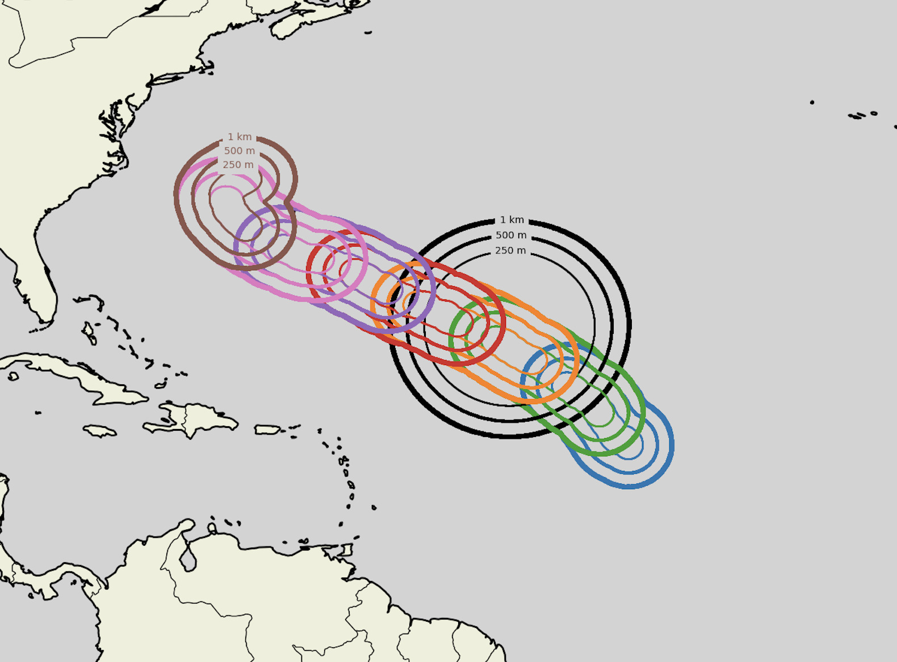

# Hurricane-Centric Setup Tools



## Overview

Hurricane-Centric Setup Tools is a comprehensive toolkit for preprocessing and running hurricane-centric numerical simulations with the ICON atmospheric model. It automates grid generation, parameter processing, and initial/boundary condition preparation with advanced SLURM job orchestration.

## Key Features

- **Multi-segment hurricane processing** with temporal reinitialization
- **TOML-based configuration** for flexible parameter management  
- **Automated workflows** with sophisticated SLURM dependency chaining
- **Nested domain grids** centered on hurricane trajectories
- **Production-ready** with parallel processing capabilities

## Quick Start

### 1. Single Segment Preprocessing
```bash
cd scripts/processing-chains
./run_hurricane_segments_preproc_chain.sh 1 -c ../../config/hurricane_config.toml
```

### 2. Multi-Segment Processing
```bash
./preproc_chain_looper.sh 1 8 -c config/hurricane_config.toml  # Process segments 1 through 8
```

### 3. Production Run
```bash
./production_looper.sh 1 5 -c ../../config/hurricane_config.toml
```

## Dependencies

- **Linux/SLURM environment** (tested on Levante/DKRZ)
- **ICON model** with tools and ExtPar
- **Python 3.7+** with `tomllib`, `numpy`, `xarray`, `netCDF4`
- **CDO** and hurricane track data

## Documentation

- **[Getting Started Guide](docs/getting_started.md)** - Installation, setup, and first steps
- **[Detailed Workflows](docs/detailed_workflows.md)** - Complete workflow documentation
- **[Configuration Reference](docs/configuration_reference.md)** - TOML configuration options
- **[Grid Generation](docs/generate_grid_for_hurricane_segments.md)** - Grid setup workflow
- **[ExtPar Processing](docs/run_extpar_levante.md)** - External parameter processing

## Contributing

1. Fork the repository
2. Create a feature branch
3. Submit a pull request

## License

MIT License - see [LICENSE](LICENSE) file for details.

## Acknowledgments

Developed with support from **BMBF-funded project IFCES2** under **SCALEXA** with **European Union - NextGenerationEU** support.
