# Detailed Workflows

This document provides comprehensive information about all available workflows in the Hurricane-Centric Setup Tools.

## Workflow Overview

```mermaid
graph TD
    A[🌀 Hurricane Track Data] --> B[📐 Grid Generation]
    B --> C[🏔️ External Parameters]
    C --> D[🌊 Initial Conditions]
    D --> E[🌪️ Boundary Conditions]
    E --> F[🧪 Test Run Validation]
    F --> G[🔄 Remap & Merge]
    G --> H[🚀 Production Run]
    H --> I[📊 Post-Processing]
```



## Core Concepts

### Segments
Hurricane simulations are divided into temporal segments with configurable reinitialization:
- **Segment 0**: Days 0-1 (e.g., Sept 7-8, 2020)
- **Segment 1**: Days 1-2 (e.g., Sept 8-9, 2020)
- **Segment 2**: Days 2-3 (e.g., Sept 9-10, 2020)
- etc.

### Nested Domains
Each segment uses multiple nested grids:
- **Domain 1**: Coarsest grid (e.g., 60km resolution)
- **Domain 2**: Intermediate grid (e.g., 40km resolution)  
- **Domain 3**: Finest grid (e.g., 20km resolution)

### Warmstart Processing
Advanced initialization technique that blends:
- **Segment data**: High-resolution fields from previous segment
- **Reference data**: Full domain data for current segment
- **Spatial blending**: Smooth transition between data sources

## Preprocessing Workflows

### 1. Single Segment Preprocessing

**Script**: `run_hurricane_segments_preproc_chain.sh`

**Purpose**: Complete preprocessing pipeline for one hurricane segment

**Usage**:
```bash
./run_hurricane_segments_preproc_chain.sh [segment_number] [sbatch_options] [-c config_file]
```

**Workflow Steps**:

#### Step 1: Grid Generation
- **Script**: `generate_grid_for_hurricane_segments.sh`
- **Purpose**: Create hurricane-centered computational grids
- **Input**: Hurricane track data, base grid configuration
- **Output**: Nested grid files for all domains
- **SLURM**: Independent job, no dependencies

#### Step 2: External Parameter Processing
- **Script**: `run_extpar_levante.bash`
- **Purpose**: Process static datasets (topography, land use, etc.)
- **Input**: Generated grids, ExtPar input datasets
- **Output**: External parameter files for all domains
- **SLURM**: `--dependency=afterok:$grid_job`

#### Step 3: Initial Conditions
- **Script**: `icon2icon_offline_lam_ini.bash`
- **Purpose**: Generate initial conditions from global data
- **Input**: ERA5 data, generated grids
- **Output**: Initial condition files
- **SLURM**: `--dependency=afterok:$grid_job` (parallel with ExtPar)

#### Step 4: Boundary Conditions
- **Script**: `icon2icon_offline_lam_lbc.bash`
- **Purpose**: Create boundary condition time series
- **Input**: ERA5 data, generated grids
- **Output**: Boundary condition files
- **SLURM**: `--dependency=afterany:$ic_job`

#### Step 5: Test Run
- **Script**: `run_hurricane_testrun_chain.sh`
- **Purpose**: Validate setup with short simulation
- **Input**: All preprocessing outputs
- **Output**: Test simulation results
- **SLURM**: `--dependency=afterany:$bc_job`

**Example**:
```bash
cd scripts/processing-chains
./run_hurricane_segments_preproc_chain.sh 1 -c ../../config/hurricane_config.toml
```

### 2. Multi-Segment Preprocessing

**Script**: `preproc_chain_looper.sh`

**Purpose**: Process multiple segments in parallel

**Usage**:
```bash
./preproc_chain_looper.sh start_segment end_segment -c|--config config_file
```

**Advantages**:
- **Parallel processing**: All segments run simultaneously
- **Resource efficiency**: Better cluster utilization
- **Independent failure**: One segment failure doesn't affect others
- **Job tracking**: Captures all job IDs for monitoring

**Example**:
```bash
# Process segments 1 through 8
./preproc_chain_looper.sh 1 8 -c ../../config/hurricane_config.toml

# Process segments 3 through 7
./preproc_chain_looper.sh 3 7 -c ../../config/hurricane_config.toml
```

**Output**:
```
Processing segments: 1 to 8
============================================================================
Submitting preprocessing chain for segment 1...
  Grid: 12345 | Extpar: 12346 | IC: 12347 | BC: 12348 | Testrun: 12349
Submitting preprocessing chain for segment 2...
  Grid: 12350 | Extpar: 12351 | IC: 12352 | BC: 12353 | Testrun: 12354
...
```

## Production Workflows

### 0. Initial Setup (Required Before First Production Run)

**Script**: `set_initial_segment.sh`

**Purpose**: Prepare initial segment for production by copying LAM files from test run

**Usage**:
```bash
./set_initial_segment.sh [segment_number] -c|--config config_file
```

**When to use**:
- **Once per configuration**: Run before starting any production cycle
- **After preprocessing**: Must be run after successful preprocessing and test runs
- **Initial segment only**: Typically run for segment 1 or your starting segment

**What it does**:
1. Validates test run completion for the specified segment
2. Copies LAM input files from test run experiment directory
3. Places files in the appropriate IC/BC directory for production use
4. Converts filenames to production naming convention

**Example**:
```bash
# Prepare segment 1 as the initial segment for production
./set_initial_segment.sh 1 -c ../../config/hurricane_config.toml

# Or prepare segment 2 if starting from there
./set_initial_segment.sh 2 -c ../../config/hurricane_config.toml
```

**⚠️ Important**: This step is **required** before starting production workflows and should only be run once per configuration.

### 1. Single Segment Production

**Script**: `run_hurricane_production_chain.sh`

**Purpose**: Run production simulation for one preprocessed segment

**Usage**:
```bash
./run_hurricane_production_chain.sh [segment_number] [-c config_file] [--nodes N] [--time HH:MM:SS] [--dependency TYPE]
```

**Workflow Steps**:

#### Step 1: Remap and Merge
- **Script**: `remap_and_merge_runner.sh`
- **Purpose**: Process IC files for warmstart (segments > 1)
- **Process**: 
  - Find IC files from previous segment
  - Remap to current segment grid
  - Blend with background data
  - Convert UV to VN wind components

#### Step 2: Create Production Runscript
- **Script**: `create_runscript.sh`
- **Purpose**: Generate ICON experiment script
- **Output**: `exp.[experiment_name]`

#### Step 3: Submit Production Job
- **Script**: `starter.sh`
- **Purpose**: Submit ICON simulation to SLURM
- **Dependency**: Waits for remap/merge completion

**Example**:
```bash
./run_hurricane_production_chain.sh 2 -c ../../config/hurricane_config.toml --nodes=64 --time=08:00:00
```

### 2. Multi-Segment Production

**Script**: `production_looper.sh`

**Purpose**: Sequential production runs with proper dependencies

**Usage**:
```bash
./production_looper.sh start_segment end_segment [-c config_file] [--nodes N] [--time HH:MM:SS]
```

**Key Features**:
- **Sequential execution**: Each segment waits for previous to complete
- **Dependency chaining**: 
  * ICON restarts itself for a given segment until the full simulation period has been completed 
  * the dependency chain for the next segment is started from the final ICON job as part of ICON's automated post-processing capabilities
- **Resource management**: Consistent resource allocation across segments

**Prerequisites**:
- All segments must be preprocessed
- Test runs must be completed and validated
- **Initial segment setup**: Must run `set_initial_segment.sh` once before starting

**Example**:
```bash
# First, set up initial segment (run once)
./set_initial_segment.sh 1 -c ../../config/hurricane_config.toml

# Then start production looper
./production_looper.sh 1 5 -c ../../config/hurricane_config.toml --nodes=128 --time=12:00:00
```

## Validation and Testing

### Test Run Validation

**Script**: `run_hurricane_testrun_chain.sh`

**Purpose**: 
1. Validate that all preprocessing files have been properly created
2. Create and submit a test simulation to verify setup integrity
3. Allow ressource estimation and a quick validation before proceeding to full production runs
4. Providie vertically interpolated IC data that are consistent and balanced


**Workflow**:
1. **File validation**: Check all preprocessing outputs exist and are valid
   - Grid files for all domains
   - External parameter files
   - Initial condition files 
   - Boundary condition files
2. **File count verification**: Ensure sufficient files based on configuration (reinit hours and domain count)
3. **Test runscript creation**: Generate a short test experiment script
4. **Test simulation submission**: Submit 5-minute test run with 20 nodes to validate setup and to create vertically interpolated IC data

**Usage**:
```bash
./run_hurricane_testrun_chain.sh [segment] -c [config_file]
```

### File Validation

**Script**: `check_preprocessing_files.py`

**Purpose**: Comprehensive file integrity checking

**File Types**:
- **grid**: Grid files for all domains
- **extpar**: External parameter files
- **ic**: Initial condition files
- **bc**: Boundary condition files
- **all**: Complete validation

**Usage**:
```bash
python check_preprocessing_files.py [config_file] [segment] [file_type]
```

**Examples**:
```bash
# Check all files for segment 2
python check_preprocessing_files.py config.toml 2 all

# Check only grid files
python check_preprocessing_files.py config.toml 2 grid

# Check IC files for all segments 1-5
for seg in {1..5}; do
    python check_preprocessing_files.py config.toml $seg ic
done
```

## Advanced Workflows

### Custom SLURM Dependencies

All scripts support sophisticated dependency management:

```bash
# Wait for specific job completion
./run_hurricane_production_chain.sh 3 -c config.toml --dependency=afterok:12345

# Chain multiple dependencies
./run_hurricane_production_chain.sh 3 -c config.toml --dependency=afterok:12345:12346

# Continue even if dependency fails
./run_hurricane_production_chain.sh 3 -c config.toml --dependency=afterany:12345
```

### Resource Customization

Adjust computational resources based on requirements:

```bash
# Very Large Runs
./production_looper.sh 1 8 -c config.toml --nodes=256 --time=08:00:00

# Quick test
./production_looper.sh 1 2 -c config.toml --nodes=32 --time=02:00:00
```

### Configuration Variants

Use different configurations for different scenarios:

```bash
# Smaller domain configuration
./run_hurricane_segments_preproc_chain.sh 1 -c ../../config/hurricane_config_width100km_reinit12h.toml

# Larger domain configuration  
./run_hurricane_segments_preproc_chain.sh 1 -c ../../config/hurricane_config_width200km_reinit24h.toml
```

## File Organization

### Generated File Structure
```bash
${OUTPUT_GRID_BASEDIR}/
└── ${PROJECT_NAME}/
    └── seg${kk}_${WIDTH_CONFIG}/
        ├── ${PROJECT_NAME}-seg${kk}_dom1_DOM01.nc
        ├── ${PROJECT_NAME}-seg${kk}_dom2_DOM01.nc
        └── ${PROJECT_NAME}-seg${kk}_dom3_DOM01.nc

${OUTPUT_ICBC_BASEDIR}/
└── ${PROJECT_NAME}/
    └── seg${kk}_${WIDTH_CONFIG}/
        ├── ifces2-atlanXL-ML_${PROJECT_NAME}_seg${kk}_DOM01_ic.nc
        ├── ${YYYYMMDD}T${HHMMSS}Z_lbc.nc
        └── ifces2-atlanXL-ML_${PROJECT_NAME}_seg${kk}_warmini.nc

${TOOLS_ICON_BUILD_DIR}/experiments/
└── ${PROJECT_NAME}-${PROJECT_WIDTH_CONFIG}-segment${kk}-${YYYYMMDDTHHMMZ}-exp111/
  ├── 2d_*.nc     # 2D output (original ICON grid and regridded)
  ├── 3d_*.nc     # 3D output (original ICON grid and regridded)
  └── lam_input_IC*.nc   # for initializaiton of next segment

${TOOLS_ICON_BUILD_DIR}/run/
├── exp.${PROJECT_NAME}-${PROJECT_WIDTH_CONFIG}-segment${kk}-${YYYYMMDDTHHMMZ}-exp111.run   # Active experiment script
└── post.${PROJECT_NAME}-${PROJECT_WIDTH_CONFIG}-segment${kk}-${YYYYMMDDTHHMMZ}-exp111.run  # Post-processing script
```

## Monitoring and Debugging

### Job Monitoring
```bash
# Monitor all your jobs
squeue -u $USER

# Check specific job details
scontrol show job [job_id]
```

### Log Analysis
```bash
# Check recent logs
ls -lt scripts/LOG/slurm-*.out | head -5

# Follow active job
tail -f scripts/LOG/slurm-[jobname]-[jobid].out

# Search for errors
grep -i error scripts/LOG/slurm-*.out
```

### Common Issues and Solutions

#### Grid Generation Failures
- **Check hurricane track data format**
- **Verify domain specifications in config**
- **Ensure sufficient disk space**

#### ExtPar Processing Issues
- **Verify input dataset availability**
- **Check module loading in SLURM environment**
- **Confirm ExtPar installation path**

#### IC/BC Generation Problems
- **Verify ERA5 data availability and format**
- **Check date ranges in configuration**
- **Ensure proper file permissions**

#### Production Run Failures
- **Check ICON build and module environment**
- **Verify all preprocessing files exist**
- **Review SLURM resource requests**

For more specific troubleshooting, see individual script documentation and log files.

## Related Documentation

- **[Getting Started Guide](getting_started.md)**: For beginners and installation instructions
- **[Configuration Reference](configuration_reference.md)**: Complete TOML parameter documentation
- **[Preparing New Hurricane Cases](preparing_new_hurricane_cases.md)**: Advanced guide for setting up different hurricanes
- **[Grid Generation](generate_grid_for_hurricane_segments.md)**: Detailed grid generation documentation
- **[ExtPar Processing](run_extpar_levante.md)**: External parameter processing guide
- **[Main README](../README.md)**: Project overview and quick start
