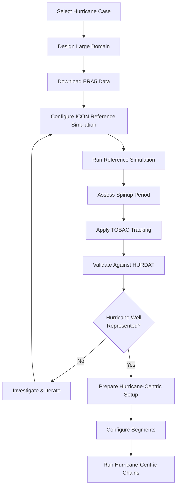

# Preparing New Hurricane Cases

This document describes the complete workflow for setting up hurricane-centric simulations for a different hurricane case than the provided reference data. This is an advanced workflow that requires significant preparation and domain expertise.

## Overview and Recommendations

⚠️ **Important Note**: Setting up a new hurricane case is a complex, multi-step process that can take weeks to months. **For learning and initial testing, we strongly recommend starting with the provided reference data** (Hurricane Paulette 2020) using the [Getting Started Guide](getting_started.md).

The complete workflow involves:
1. Large domain ICON simulations (reference simulations)
2. Special namelist configuration for LAM output
3. Hurricane tracking with TOBAC
4. Track validation against observations
5. Handling simulation spinup
6. Quality assessment before proceeding

## Workflow Overview



## 1. Large Domain ICON Simulations (Reference Simulations)

### 1.1 Domain Selection

The reference simulation must use a large domain that:
- **Spatially contains** the complete hurricane lifecycle
- **Temporally covers** the period of interest plus spinup time
- Has **sufficient resolution** to represent hurricane dynamics (typically ≤20 km)

**Domain Requirements**:
```
Spatial Coverage: Hurricane track + 500-1000 km buffer
Temporal Coverage: Hurricane lifetime + 1-2 days spinup
Resolution: 2-5 km 
Vertical Levels: Full atmosphere (≥70 levels recommended)
```

### 1.2 ERA5 Data Preparation

Download and prepare ERA5 data for:
- **Initial Conditions**: Single time point for simulation start
- **Boundary Conditions**: Time series for entire simulation period
- **Variables**: All atmospheric and surface fields required by ICON

**ERA5 Requirements**:
- Pressure levels: 1000, 925, 850, 700, 500, 300, 250, 200, 150, 100, 70, 50, 30, 20, 10 hPa
- Surface fields: MSLP, 10m winds, 2m temperature, etc.
- Temporal resolution: 6-hourly (minimum) or higher
- Spatial coverage: Larger than your ICON domain

## 2. Special Namelist Configuration for LAM Output

### 2.1 LAM Output Requirements

The reference simulation must output **LAM (Limited Area Model) files** in the correct format for hurricane-centric setup. These files serve as boundary conditions for the nested simulations.

### 2.2 Critical Namelist Settings

Add the following section to your ICON runscript for LAM output:

```fortran
&output_nml
 output_filename  = "${EXPNAME}_lam"
 filename_format  = "<output_filename>_<levtype_l>_<datetime2>"
 filetype         = 5
 remap            = 0
 output_grid      = .TRUE.
 output_start     = "${start_date}"
 output_end       = "${end_date}"
 output_interval  = "PT01H"
 file_interval    = "P01D"
 include_last     = .FALSE.
 ml_varlist       = 'u','v','w','temp','pres','qv','qc','qi','qr','qs','qg',
                    'tke','z_ifc','z_mc','rho'
 pl_varlist       = 'u','v','temp','geopot','rh'
 hl_varlist       = 'u','v','temp','pres','qv','qc','qi','qr','qs','qg'
 mode             = 1
 dom              = 2
/
```

**Key Parameters**:
- **`output_filename`**: Must follow pattern `${EXPNAME}_lam`
- **`filetype = 5`**: NetCDF format for LAM coupling
- **`output_interval = "PT01H"`**: Hourly output (can be adjusted)
- **`file_interval = "P01D"`**: Daily files
- **`dom = 2`**: Usually the intermediate domain
- **`ml_varlist`**: Full 3D model level variables
- **`pl_varlist`**: Pressure level variables
- **`hl_varlist`**: Height level variables

### 2.3 Additional Output for Tracking

Add surface output for hurricane tracking:

```fortran
&output_nml
 output_filename  = "${EXPNAME}_2d_surface"
 filename_format  = "<output_filename>_<levtype_l>_<datetime2>"
 filetype         = 5
 remap            = 0
 output_grid      = .TRUE.
 output_start     = "${start_date}"
 output_end       = "${end_date}"
 output_interval  = "PT01H"
 file_interval    = "P01D"
 include_last     = .FALSE.
 ml_varlist       = 'u_10m','v_10m','sp','msl','vort_10m'
 mode             = 1
 dom              = 2
/
```

**Critical for Tracking**:
- **`vort_10m`**: 10m vorticity field (primary tracking variable)
- **`u_10m`, `v_10m`**: 10m wind components
- **`msl`**: Mean sea level pressure
- **`sp`**: Surface pressure

## 3. Hurricane Tracking with TOBAC

### 3.1 TOBAC Setup

Use the **TOBAC (Tracking and Object-Based Analysis of Clouds)** Python package for automated hurricane tracking:

```bash
# Install TOBAC
pip install tobac

# Dependencies
pip install xarray netcdf4 scipy scikit-image matplotlib cartopy
```

### 3.2 Tracking Configuration

Track hurricanes using the **10m horizontal vorticity field** from the `2d_surface` output:

```python
import tobac
import xarray as xr

# Load ICON 2D surface output
ds = xr.open_mfdataset('path/to/*_2d_surface_*.nc')

# Extract 10m vorticity (coarse-grained)
vort_10m = ds.vort_10m

# TOBAC tracking parameters
feature_detection_params = {
    'threshold': 1e-4,  # Vorticity threshold (s^-1)
    'min_num': 10,      # Minimum number of grid points
    'min_distance': 50, # Minimum distance between features (km)
    'sigma_threshold': 1.0,
    'n_erosion_threshold': 0,
    'n_min_threshold': 10
}

tracking_params = {
    'v_max': 30,        # Maximum velocity (m/s)
    'd_max': 500,       # Maximum distance (km)
    'method_linking': 'predict'
}

# Run TOBAC tracking
features = tobac.feature_detection_multithreshold(
    vort_10m, 
    dxy=10000,  # Grid spacing in meters
    **feature_detection_params
)

tracks = tobac.linking_trackpy(
    features,
    dt=3600,  # Time step in seconds
    **tracking_params
)
```

### 3.3 Track Processing

Convert TOBAC output to hurricane track format:

```python
# Filter for hurricane-like tracks
hurricane_tracks = tracks[
    (tracks.track_duration > pd.Timedelta('48H')) &  # Minimum 48h duration
    (tracks.max_vorticity > 5e-4)                    # Strong vorticity
]

# Convert to format compatible with hurricane-centric tools
def create_hurricane_track_file(track_data, output_file):
    """Convert TOBAC track to NetCDF format for grid generation"""
    track_ds = xr.Dataset({
        'time': (['time'], track_data.time),
        'lon': (['time'], track_data.longitude),
        'lat': (['time'], track_data.latitude),
        'intensity': (['time'], track_data.max_vorticity)
    })
    track_ds.to_netcdf(output_file)
```

## 4. Track Validation Against HURDAT

### 4.1 HURDAT Data

Download **HURDAT2 (Hurricane Database)** observational data:
- Source: https://www.nhc.noaa.gov/data/hurdat/
- Format: ASCII text with hurricane positions and intensities
- Coverage: Atlantic and Eastern Pacific basins

### 4.2 Track Comparison

Compare TOBAC tracks with HURDAT observations:

```python
import numpy as np
from scipy.spatial.distance import cdist

def validate_track_against_hurdat(tobac_track, hurdat_track, time_tolerance='3H'):
    """
    Compare TOBAC track with HURDAT observations
    Returns track with smallest spatial deviations
    """
    
    # Interpolate tracks to common time grid
    common_times = pd.date_range(
        max(tobac_track.time.min(), hurdat_track.time.min()),
        min(tobac_track.time.max(), hurdat_track.time.max()),
        freq='6H'
    )
    
    # Calculate spatial deviations
    deviations = []
    for time in common_times:
        # Find nearest times in both datasets
        tobac_pos = get_position_at_time(tobac_track, time)
        hurdat_pos = get_position_at_time(hurdat_track, time)
        
        if tobac_pos is not None and hurdat_pos is not None:
            # Calculate great circle distance
            deviation = haversine_distance(tobac_pos, hurdat_pos)
            deviations.append(deviation)
    
    mean_deviation = np.mean(deviations)
    return mean_deviation, deviations

# Select best track
best_track = None
min_deviation = float('inf')

for track_id in hurricane_tracks.track.unique():
    track_subset = hurricane_tracks[hurricane_tracks.track == track_id]
    deviation, _ = validate_track_against_hurdat(track_subset, hurdat_data)
    
    if deviation < min_deviation:
        min_deviation = deviation
        best_track = track_subset

print(f"Best track has mean deviation of {min_deviation:.1f} km")
```

### 4.3 Quality Thresholds

Accept tracks with:
- **Mean deviation < 100 km** (excellent)
- **Mean deviation < 200 km** (good)
- **Mean deviation > 300 km** (investigate simulation issues)

## 5. Handling Simulation Spinup

### 5.1 Spinup Assessment

**Disregard initial simulation period** to avoid spinup artifacts:

```python
# Typical spinup periods
spinup_periods = {
    'atmosphere': '24H',    # 1 day atmospheric spinup
    'ocean_coupled': '7D',  # 7 days for coupled runs
    'land_surface': '30D'   # 30 days for land surface equilibrium
}

# Remove spinup from analysis
effective_start = simulation_start + pd.Timedelta(spinup_periods['atmosphere'])
analysis_data = simulation_data.sel(time=slice(effective_start, None))
```

### 5.2 Spinup Indicators

Monitor these variables to assess spinup completion:
- **Precipitation**: Should stabilize after 12-24 hours
- **Surface pressure tendency**: Large initial adjustments should decay
- **Hurricane intensity**: Artificial intensification/weakening during spinup
- **Energy budgets**: Global energy should stabilize

## 6. Quality Assessment

### 6.1 Hurricane Representation Assessment

Before proceeding with hurricane-centric setup, validate that your reference simulation **adequately represents the observed hurricane**:

**Critical Checks**:
1. **Track accuracy**: < 200 km mean deviation from HURDAT
2. **Timing**: Hurricane phases align with observations
3. **Intensity**: Reasonable intensity evolution (within ~20 hPa MSLP)
4. **Structure**: Recognizable hurricane eye/eyewall in surface pressure
5. **Lifecycle**: Captures formation, intensification, decay phases

### 6.2 Diagnostic Plots

Create validation plots:

```python
# Track comparison plot
fig, ax = plt.subplots(figsize=(12, 8))
ax.plot(hurdat_lon, hurdat_lat, 'k-', linewidth=3, label='HURDAT Observed')
ax.plot(tobac_lon, tobac_lat, 'r--', linewidth=2, label='ICON Simulated')
ax.set_title(f'Hurricane Track Comparison - Mean Deviation: {mean_deviation:.1f} km')

# Intensity time series
fig, ax = plt.subplots(figsize=(12, 6))
ax.plot(hurdat_time, hurdat_mslp, 'k-', label='HURDAT MSLP')
ax.plot(icon_time, icon_mslp, 'r--', label='ICON MSLP')
ax.invert_yaxis()  # Lower pressure = stronger
ax.set_ylabel('MSLP (hPa)')
ax.set_title('Hurricane Intensity Evolution')
```

### 6.3 Stopping Criteria

**Stop and investigate if**:
- Mean track deviation > 300 km
- Hurricane forms >24 hours late/early
- Peak intensity differs by >30 hPa
- Hurricane dissipates prematurely
- No coherent vortex structure in simulation

**Common Issues and Solutions**:
- **Poor track**: Check domain coverage, boundary conditions
- **Weak intensity**: Increase resolution, check surface fluxes
- **Wrong timing**: Verify initial conditions, spinup handling
- **No formation**: Check SST, atmospheric instability

## 7. Understanding the Segment Concept

### 7.1 Segment Definition

**Segments** divide the hurricane simulation into overlapping time periods:

```
Segment Timing Formula:
segment_start_time = init_time + (iseg * reinit_hours)

Where:
- init_time: Reference simulation start time
- iseg: Segment number (0, 1, 2, ...)
- reinit_hours: Hours between reinitializations (12 or 24)
```

### 7.2 Segment Examples

**Example 1: 24-hour reinit, 1-day spinup**
```
Reference init: 2020-09-07 00:00 UTC
Spinup period: 24 hours
Effective start: 2020-09-08 00:00 UTC

Segment 0: 2020-09-07 00:00 UTC (during spinup, skip)
Segment 1: 2020-09-08 00:00 UTC (first meaningful segment)
Segment 2: 2020-09-09 00:00 UTC
Segment 3: 2020-09-10 00:00 UTC
```

**Example 2: 12-hour reinit, 1-day spinup**
```
Reference init: 2020-09-07 00:00 UTC
Spinup period: 24 hours
Effective start: 2020-09-08 00:00 UTC

Segment 0: 2020-09-07 00:00 UTC (during spinup, skip)
Segment 1: 2020-09-07 12:00 UTC (during spinup, skip)
Segment 2: 2020-09-08 00:00 UTC (first meaningful segment)
Segment 3: 2020-09-08 12:00 UTC
Segment 4: 2020-09-09 00:00 UTC
```

### 7.3 Segment Selection Strategy

**First Meaningful Segment**:
```python
def calculate_first_segment(init_time, spinup_hours, reinit_hours):
    """Calculate first segment after spinup"""
    spinup_segments = int(np.ceil(spinup_hours / reinit_hours))
    first_segment = spinup_segments
    
    first_segment_time = init_time + pd.Timedelta(hours=first_segment * reinit_hours)
    return first_segment, first_segment_time

# Example usage
init_time = pd.Timestamp('2020-09-07 00:00')
spinup_hours = 24
reinit_hours = 12

first_seg, first_time = calculate_first_segment(init_time, spinup_hours, reinit_hours)
print(f"First meaningful segment: {first_seg} at {first_time}")
# Output: First meaningful segment: 2 at 2020-09-08 00:00:00
```

**Segment Planning**:
1. **Always start with segment 0** for reference fields
2. **Skip spinup segments** for analysis
3. **Choose meaningful segments** based on hurricane lifecycle
4. **Plan total segments** to cover period of interest

## 8. Preparing Hurricane-Centric Configuration

### 8.1 Update Configuration File

Once you have a validated reference simulation and track, update your TOML configuration:

```toml
[project]
name = "hurricane-ida2021-segments"
width_config = "width20km_reinit12h"
working_dir = "/scratch/b/b380352/icontools"

[reference]
init_time = "20210828T000000Z"  # Your reference simulation start
expname = "your-reference-experiment-name"
input_grid = "/path/to/your/reference/grid.nc"
input_icbc_dir = "/path/to/your/reference/output"
input_icbc_subdir = "LAM"  # Subdirectory with LAM files

[track]
track_dir = "/path/to/your/track/files"
track_file = "your-hurricane-track-best-fit.nc"  # From TOBAC analysis

[domains]
segment_reinit_hours = 12.0  # Match your choice
segment_length_added = 3.0
nests = 3
dom_width = [60.0, 40.0, 20.0]
```

### 8.2 File Organization

Organize your prepared data:

```
your_hurricane_case/
├── reference_simulation/
│   ├── grids/
│   ├── output/
│   │   └── LAM/           # LAM files for boundary conditions
│   └── namelists/
├── tracking/
│   ├── tobac_output/
│   ├── hurdat_data/
│   └── best_fit_track.nc  # Selected track
└── hurricane_centric/
    ├── config/
    │   └── hurricane_config_ida2021.toml
    └── runs/
```

## 9. Summary and Next Steps

### 9.1 Complete Workflow Checklist

- [ ] **Reference Simulation**: Large domain ICON run with LAM output
- [ ] **Spinup Assessment**: Determine and exclude spinup period
- [ ] **Hurricane Tracking**: Apply TOBAC to 10m vorticity
- [ ] **Track Validation**: Compare with HURDAT, select best track
- [ ] **Quality Assessment**: Verify hurricane representation
- [ ] **Configuration**: Update TOML with your case data
- [ ] **Segment Planning**: Calculate meaningful segment range
- [ ] **Hurricane-Centric Runs**: Proceed with processing chains

### 9.2 Learning Recommendations

**For beginners**: Start with the provided Hurricane Paulette 2020 case using the [Getting Started Guide](getting_started.md) before attempting new cases.

**For advanced users**: This workflow requires expertise in:
- ICON model configuration and namelist setup
- Hurricane meteorology and tracking
- Python data analysis (TOBAC, xarray)
- High-performance computing environments
- NetCDF data handling

### 9.3 Support and Resources

- **Reference implementation**: Study the Paulette 2020 case setup
- **TOBAC documentation**: https://tobac.readthedocs.io/
- **HURDAT data**: https://www.nhc.noaa.gov/data/hurdat/
- **ICON documentation**: https://www.icon-model.org/
- **ERA5 data**: https://cds.climate.copernicus.eu/

For questions about this workflow, consider the complexity and ensure you have validated each step before proceeding to hurricane-centric simulations.

## Related Documentation

- **[Getting Started Guide](getting_started.md)**: Learn with provided reference data
- **[Configuration Reference](configuration_reference.md)**: TOML parameter documentation
- **[Detailed Workflows](detailed_workflows.md)**: Processing chain documentation
- **[Main README](../README.md)**: Project overview and quick start
