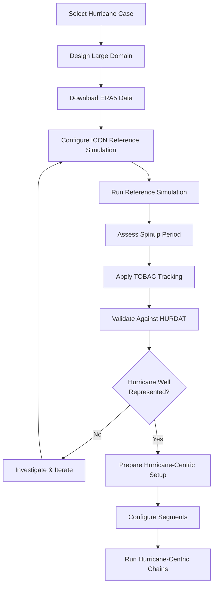

# Preparing New Hurricane Cases

This document describes the complete workflow for setting up hurricane-centric simulations for a different hurricane case than the provided reference data. This is an advanced workflow that requires significant preparation and domain expertise.

## Overview and Recommendations

⚠️ **Important Note**: Setting up a new hurricane case is a complex, multi-step process that can take weeks to months. **For learning and initial testing, we strongly recommend starting with the provided reference data** (Hurricane Paulette 2020) using the [Getting Started Guide](getting_started.md).

The complete workflow involves:
1. Large domain ICON simulations (reference simulations)
2. Special namelist configuration for LAM output
3. Hurricane tracking with TOBAC
4. Track validation against observations
5. Handling simulation spinup
6. Quality assessment before proceeding

## Workflow Overview



## 1. Large Domain ICON Simulations (Reference Simulations)

### 1.1 Domain Selection

The reference simulation must use a large domain that:
- **Spatially contains** the complete hurricane lifecycle
- **Temporally covers** the period of interest plus spinup time
- Has **sufficient resolution** to represent hurricane dynamics

**Domain Requirements**:
```
Spatial Coverage: Hurricane track + 500-1000 km buffer
Temporal Coverage: Hurricane lifetime + 1-2 days spinup
Resolution: 2-5 km (convection permitting )
Vertical Levels: Full atmosphere (≥70 levels recommended)
```

### 1.2 ERA5 Data Preparation

Download and prepare ERA5 data for:
- **Initial Conditions**: Single time point for simulation start
- **Boundary Conditions**: Time series for entire simulation period

Some further information:
- ICON source is containing a download script of ECMWF MARS
- ECMWF MARS typically demand special access permissions

## 2. Namelist Configuration for Required Output

### 2.1 LAM Output Requirements

The reference simulation must output **LAM (Limited Area Model) files** in the correct format for hurricane-centric setup. These files serve as initial and boundary conditions for the nested simulations.

### 2.2 Critical Namelist Settings for Initial Conditions

Add the following section to your ICON runscript for LAM IC output:

```fortran
&output_nml
/
!====================================================================
! LAM IC
! ===================================================================
&output_nml
 output_start     = "${ic_output_start_date}"
 output_end       = "${end_date}"
 include_last     = .TRUE.
 output_interval  = "PT06H"
 file_interval    = "PT06H"
 dom              = 2
 output_filename  = 'lam_input_IC'
 filename_format  = "<output_filename>_DOM<physdom>_<levtype>_<datetime2>"
 ml_varlist = 'rho','pres', 'temp', 'theta_v','QV',
              'QC', 'QI','QR', 'QS', 'QG','QH',
              'QNC', 'QNI','QNR', 'QNS', 'QNG','QNH',
              'TKE', 'U','V', 'VN', 'W', 'c_t_lk',
              'freshsnow', 'fr_seaice', 'h_ice', 'h_ml_lk', 'h_snow', 'hsnow_max',
              'qv_s', 'rho_snow', 't_sk', 'snowfrac', 't_bot_lk','t_ice', 't_mnw_lk',
              't_seasfc', 't_snow', 't_wml_lk', 'w_i', 'gz0', 't_so', 't_2m', 'w_so',
              'w_so_ice', 'z_ifc','z_mc','t_g','w_snow'
 filetype         = 5
/

/
```


**Key Parameters**:
 -**`output_start`**: is defined by `${ic_output_start_date}` which is simulation start date plus spinup time (e.g. 1 day)
- **`output_filename`**: Must follow pattern `lam_input_IC`
- **`filetype = 5`**: NetCDF format for LAM coupling
- **`output_interval = "PT06H"`**: 6-hourly output (can be adjusted, this allows reinit6h or more)
- **`file_interval = "PT06H"`**: 6-hourly files
- **`dom = 2`**: Should target the finest nest if reference simulations are done with multiple nests (here a 2-domain setup is used)
- **`ml_varlist`**: Full 2D and 3D model level variables (two-moment microphysical variables are included and need to be deleted if simpler schemes are used)


### 2.3 Critical Namelist Settings for Lateral Boundary Conditions

Add the following section to your ICON runscript for LAM BC output:

```fortran
!====================================================================
! LAM BC
! ===================================================================
&output_nml
 output_start     = "${ic_output_start_date}"
 output_end       = "${end_date}"
 include_last     = .TRUE.
 output_interval  = "PT01H"
 file_interval    = "PT01H"
 dom              = 2
 output_filename  = 'lam_input_BC'
 filename_format  = "<output_filename>_DOM<physdom>_<levtype>_<datetime2>"
 ml_varlist = 'rho', 'QV', 'theta_v', 'VN', 'W',
              'QC', 'QI','QR', 'QS', 'QG','QH',
              'QNC', 'QNI','QNR', 'QNS', 'QNG','QNH'
 filetype         = 5
/
```

**Key Parameters**:
 -**`output_start`**: is defined by `${ic_output_start_date}` which is simulation start date plus spinup time (e.g. 1 day)
- **`output_filename`**: Must follow pattern `lam_input_BC`
- **`filetype = 5`**: NetCDF format for LAM coupling
- **`output_interval = "PT01H"`**: hourly output (can be adjusted, this allows reinit6h or more)
- **`file_interval = "PT01H"`**: hourly files
- **`dom = 2`**: Should target the finest nest if reference simulations are done with multiple nests (here a 2-domain setup is used)
- **`ml_varlist`**: Full 2D and 3D model level variables (two-moment microphysical variables are included and need to be deleted if simpler schemes are used)


### 2.4 Additional Output for Tracking

Add surface output for hurricane tracking:

```fortran
&output_nml
 output_start     = "${start_date}"
 output_end       = "${end_date}"
 output_interval  = "PT15M"
 file_interval    = "PT01H"
 include_last     = .TRUE.
 output_filename  = '2d_surface'
 remap            = 1
 filename_format  = "<output_filename>_DOM<physdom>_<levtype>_<datetime2>_regrid7km"
 ml_varlist       = 'lhfl_s','shfl_s','umfl_s','vmfl_s','t_g','pres_sfc','qv_s','t_2m','qv_2m',
                    'rh_2m','u_10m','v_10m','w_so','t_so','runoff_s','t_s','t_seasfc',
                    'tcm','tch'

 reg_lon_def      = ${reg_lon_def}
 reg_lat_def      = ${reg_lat_def}
 filetype         = 5
/
```
If you intend to track on 10m winds then only `u_10m` and `v_10m` are needed. However, the other surface variables are a great resource for monitoring hurricane evolution.

**Key Parameters**:
- **`output_interval = "PT15M"`**: 15-minute output (can be adjusted, should be sufficiently high)
- **`remap = 1`**: use data remapped onto regular lon/lat grid
- **` reg_lon_def=${reg_lon_def}`**: analysis domain definition need to be chosen carefully, e.g. `reg_lon_def="-85,0.064,-15"` 
- **` reg_lat_def=${reg_lat_def}`**: analysis domain definition need to be chosen carefully, e.g. `reg_lat_def="0,0.06,46"`


## 3. Hurricane Tracking with TOBAC

### 3.1 Main Steps for Tracking

1. convert 10 m winds to **10m horizontal vorticity field** and coarse-grain vorticity with a Gauss filter (width ~ 100 km)

2. input coarse-grained vorticity into **tobac (Tracking and Object-Based Analysis of Clouds)** - Python package for automated hurricane tracking

3. set reasonable thresholds (e.g. 10 revolutions per day) and apply feature detection and linking

4. store track dataset into a netcdf file

### 3.2 Track Validation Against HURDAT

Download **HURDAT2 (Hurricane Database)** observational data:
- Source: https://www.nhc.noaa.gov/data/hurdat/
- Format: ASCII text with hurricane positions and intensities
- Coverage: Atlantic and Eastern Pacific basins

**Compare TOBAC tracks with HURDAT observations**:
- calculate spatial distances between tobac tracks and the selected hurricane track from HURDAT
- identify the best fitting tobac track based on mean spatial deviation
- redo tobac tracking with different parameter settings if track validation fails

## 4. Quality Assessment

Before proceeding with hurricane-centric setup, validate that your reference simulation **adequately represents the observed hurricane**:

**Critical Checks**:
1. **Track accuracy**: < 200 km mean deviation from HURDAT
2. **Timing**: Hurricane phases align with observations
3. **Intensity**: Reasonable intensity evolution (within ~20 hPa MSLP)
4. **Structure**: Recognizable hurricane eye/eyewall
5. **Lifecycle**: Captures formation, intensification, decay phases


## 5. Understanding the Segment Concept

### 5.1 Segment Definition

**Segments** divide the hurricane simulation into overlapping time periods:

Segment Timing Formula: `segment_start_time = init_time + (iseg * reinit_hours)`

Where:
- `init_time`: Reference simulation start time
- `iseg`: Segment number (0, 1, 2, ...)
- `reinit_hours`: Hours between reinitializations (12 or 24)

### 5.2 Segment Examples

**Example 1: 24-hour reinit, 1-day spinup**
```
Reference init: 2020-09-07 00:00 UTC
Spinup period: 24 hours
Effective start: 2020-09-08 00:00 UTC

Segment 0: 2020-09-07 00:00 UTC (during spinup, skip)
Segment 1: 2020-09-08 00:00 UTC (first meaningful segment)
Segment 2: 2020-09-09 00:00 UTC
Segment 3: 2020-09-10 00:00 UTC
```

**Example 2: 12-hour reinit, 1-day spinup**
```
Reference init: 2020-09-07 00:00 UTC
Spinup period: 24 hours
Effective start: 2020-09-08 00:00 UTC

Segment 0: 2020-09-07 00:00 UTC (during spinup, skip)
Segment 1: 2020-09-07 12:00 UTC (during spinup, skip)
Segment 2: 2020-09-08 00:00 UTC (first meaningful segment)
Segment 3: 2020-09-08 12:00 UTC
Segment 4: 2020-09-09 00:00 UTC
```

**Segment Planning**:
1. **Always start counting with segment 0** for reference fields
2. **Skip spinup segments** for analysis
3. **Choose meaningful segments** based on hurricane lifecycle
4. **Plan total segments** to cover period of interest

## 6. Preparing Hurricane-Centric Configuration

### 6.1 Update Configuration File

Once you have a validated reference simulation and track, update your TOML configuration:

```toml
[project]
name = "hurricane-ida2021-segments"
width_config = "width20km_reinit12h"
working_dir = "/scratch/b/b380352/icontools"

[reference]
init_time = "20210828T000000Z"  # Your reference simulation start
expname = "your-reference-experiment-name"
input_grid = "/path/to/your/reference/grid.nc"
input_icbc_dir = "/path/to/your/reference/output"
input_icbc_subdir = "LAM"  # Subdirectory with LAM files

[track]
track_dir = "/path/to/your/track/files"
track_file = "your-hurricane-track-best-fit.nc"  # From TOBAC analysis

[domains]
segment_reinit_hours = 12.0  # Match your choice
segment_length_added = 3.0
nests = 3
dom_width = [60.0, 40.0, 20.0]
```

### 8.2 File Organization

Organize your prepared data:

```
your_hurricane_case/
├── reference_simulation/
│   ├── grids/
│   ├── output/
│   │   └── LAM/           # LAM files for boundary conditions
│   └── namelists/
├── tracking/
│   ├── tobac_output/
│   ├── hurdat_data/
│   └── best_fit_track.nc  # Selected track
└── hurricane_centric/
    ├── config/
    │   └── hurricane_config_ida2021.toml
    └── runs/
```

## 9. Summary and Next Steps

### 9.1 Complete Workflow Checklist

- [ ] **Reference Simulation**: Large domain ICON run with LAM output
- [ ] **Spinup Assessment**: Determine and exclude spinup period
- [ ] **Hurricane Tracking**: Apply TOBAC to 10m vorticity
- [ ] **Track Validation**: Compare with HURDAT, select best track
- [ ] **Quality Assessment**: Verify hurricane representation
- [ ] **Configuration**: Update TOML with your case data
- [ ] **Segment Planning**: Calculate meaningful segment range
- [ ] **Hurricane-Centric Runs**: Proceed with processing chains

### 9.2 Learning Recommendations

**For beginners**: Start with the provided Hurricane Paulette 2020 case using the [Getting Started Guide](getting_started.md) before attempting new cases.

**For advanced users**: This workflow requires expertise in:
- ICON model configuration and namelist setup
- Hurricane meteorology and tracking
- Python data analysis (TOBAC, xarray)
- High-performance computing environments
- NetCDF data handling

### 9.3 Support and Resources

- **Reference implementation**: Study the Paulette 2020 case setup
- **TOBAC documentation**: https://tobac.readthedocs.io/
- **HURDAT data**: https://www.nhc.noaa.gov/data/hurdat/
- **ICON documentation**: https://www.icon-model.org/
- **ERA5 data**: https://cds.climate.copernicus.eu/

For questions about this workflow, consider the complexity and ensure you have validated each step before proceeding to hurricane-centric simulations.

## Related Documentation

- **[Getting Started Guide](getting_started.md)**: Learn with provided reference data
- **[Configuration Reference](configuration_reference.md)**: TOML parameter documentation
- **[Detailed Workflows](detailed_workflows.md)**: Processing chain documentation
- **[Main README](../README.md)**: Project overview and quick start
