# Preprocessing Chain Looper Dependencies Graph

This document shows the dependency graph for `preproc_chain_looper.sh` using Mermaid notation.

```mermaid
graph TD
    %% Main Entry Point
    PCL[preproc_chain_looper.sh<br/>🎯 Main Script]
    
    %% Direct Dependencies - Core Chain
    PCL --> RHSPC[run_hurricane_segments_preproc_chain.sh<br/>🔄 Segment Preprocessing Chain]
    
    %% Segment Chain Dependencies - Configuration
    RHSPC --> CH[utilities/config_handler.sh<br/>📋 Config Parser]
    RHSPC --> TR[utilities/toml_reader.sh<br/>📝 TOML Reader]
    RHSPC --> CONFIG[config/hurricane_config.toml<br/>⚙️ Configuration File]
    
    %% Segment Chain Dependencies - Grid & Extpar
    RHSPC --> GGS[grid-extpar/generate_grid_for_hurricane_segments.sh<br/>🌐 Grid Generator]
    RHSPC --> REL[grid-extpar/run_extpar_levante.bash<br/>🏔️ External Parameters]
    
    %% Segment Chain Dependencies - IC & BC
    RHSPC --> I2I_INI[ic-bc/icon2icon_offline_lam_ini.bash<br/>🌀 Initial Conditions]
    RHSPC --> I2I_LBC[ic-bc/icon2icon_offline_lam_lbc.bash<br/>🌊 Boundary Conditions]
    
    %% Segment Chain Dependencies - Test Run
    RHSPC --> RTC[run_hurricane_testrun_chain.sh<br/>🧪 Test Run Chain]
    
    %% Grid Generator Dependencies
    GGS --> CH
    GGS --> TR
    GGS --> CONFIG
    GGS --> MASK35[utilities/35-Create-a-Segment-Mask-for-Hurricane-Centric-Runs.py<br/>🎭 Segment Mask Creator]
    
    %% External Parameters Dependencies
    REL --> CH
    REL --> TR
    REL --> CONFIG
    
    %% Initial Conditions Dependencies
    I2I_INI --> CH
    I2I_INI --> TR
    I2I_INI --> CONFIG
    I2I_INI --> FICBC[utilities/find_icbc_file.py<br/>🔍 IC/BC File Finder]
    
    %% Boundary Conditions Dependencies
    I2I_LBC --> CH
    I2I_LBC --> TR
    I2I_LBC --> CONFIG
    I2I_LBC --> FICBC
    
    %% Test Run Chain Dependencies
    RTC --> CH
    RTC --> TR
    RTC --> CONFIG
    RTC --> RMRR[ic-bc/remap_and_merge_runner.sh<br/>🔄 Remap & Merge]
    RTC --> CRS[runscripts/create_runscript.sh<br/>📜 Runscript Creator]
    RTC --> STARTER[runscripts/starter.sh<br/>🚀 Job Starter]
    RTC --> CPF[utilities/check_preprocessing_files.py<br/>✅ File Validator]
    
    %% Remap and Merge Dependencies
    RMRR --> CH
    RMRR --> TR
    RMRR --> CONFIG
    RMRR --> RMWS[ic-bc/remap_and_merge_icfiles_for_warmstart.sh<br/>🌊 Warmstart Merger]
    
    %% Warmstart Merger Dependencies
    RMWS --> GRID58[utilities/58-Updated-Method-to-Combine-Center-Grids-from-Different-Segments.py<br/>🌐 Grid Combiner]
    RMWS --> UVVN[ic-bc/replace_uv_with_vn_in_icfile.sh<br/>🌪️ UV to VN Converter]
    
    %% UV to VN Converter Dependencies
    UVVN --> UVCONV[utilities/uvedge_to_vnormal_converter.py<br/>⚡ UV Edge Converter]
    
    %% Create Runscript Dependencies
    CRS --> CH
    CRS --> TR
    CRS --> CONFIG
    CRS --> PT[utilities/print_timings.py<br/>⏰ Timing Calculator]
    CRS --> ERB[utilities/extract_region_bounds.py<br/>📐 Region Extractor]
    CRS --> EXPTEMPLATE[runscripts/exp.TEMPLATE_for_segment_runscript<br/>📋 Experiment Template]
    
    %% Starter Dependencies
    STARTER --> CH
    STARTER --> TR
    STARTER --> CONFIG
    
    %% Configuration Dependencies
    CH --> TR
    
    %% Python Utilities Dependencies
    MASK35 --> HELPERS[utilities/helpers.py<br/>🛠️ Helper Functions]
    FICBC --> HELPERS
    PT --> HELPERS
    CPF --> HELPERS
    
    %% Helper Dependencies
    HELPERS --> TR
    HELPERS --> CONFIG
    
    %% External Dependencies
    CONFIG --> PYTHON[Python 3<br/>🐍 Runtime]
    MASK35 --> PYTHON
    FICBC --> PYTHON
    PT --> PYTHON
    GRID58 --> PYTHON
    UVCONV --> PYTHON
    ERB --> PYTHON
    CPF --> PYTHON
    HELPERS --> PYTHON
    
    %% SLURM Integration
    PCL --> SLURM[SLURM Workload Manager<br/>⚡ Job Scheduler]
    RHSPC --> SLURM
    GGS --> SLURM
    REL --> SLURM
    I2I_INI --> SLURM
    I2I_LBC --> SLURM
    RTC --> SLURM
    RMRR --> SLURM
    STARTER --> SLURM
    
    %% Module System
    PCL --> MODULE[Module System<br/>📦 Environment]
    RHSPC --> MODULE
    GGS --> MODULE
    REL --> MODULE
    I2I_INI --> MODULE
    I2I_LBC --> MODULE
    RTC --> MODULE
    
    %% ICON Tools Dependencies
    GGS --> ICONTOOLS[ICON Grid Tools<br/>🔧 Grid Generation]
    REL --> ICONTOOLS
    I2I_INI --> ICONTOOLS
    I2I_LBC --> ICONTOOLS
    STARTER --> ICONDIR[TOOLS_ICON_BUILD_DIR/run<br/>🏗️ ICON Build Directory]
    
    %% File System Dependencies
    PCL --> FILESYSTEM[File System<br/>💾 Storage]
    RHSPC --> FILESYSTEM
    GGS --> FILESYSTEM
    REL --> FILESYSTEM
    I2I_INI --> FILESYSTEM
    I2I_LBC --> FILESYSTEM
    RTC --> FILESYSTEM
    RMRR --> FILESYSTEM
    
    %% Style Definitions
    classDef mainScript fill:#ff6b6b,stroke:#d63031,stroke-width:3px,color:#fff
    classDef chainScript fill:#74b9ff,stroke:#0984e3,stroke-width:2px,color:#fff
    classDef configScript fill:#74b9ff,stroke:#0984e3,stroke-width:2px,color:#fff
    classDef utilityScript fill:#55a3ff,stroke:#2d3436,stroke-width:2px,color:#fff
    classDef pythonScript fill:#00b894,stroke:#00826c,stroke-width:2px,color:#fff
    classDef templateFile fill:#fdcb6e,stroke:#e17055,stroke-width:2px,color:#000
    classDef configFile fill:#a29bfe,stroke:#6c5ce7,stroke-width:2px,color:#fff
    classDef externalDep fill:#636e72,stroke:#2d3436,stroke-width:2px,color:#fff
    classDef system fill:#fd79a8,stroke:#e84393,stroke-width:2px,color:#fff
    
    %% Apply Styles
    class PCL mainScript
    class RHSPC,RTC,RMRR,RMWS,UVVN,CRS,STARTER chainScript
    class GGS,REL,I2I_INI,I2I_LBC configScript
    class CH,TR utilityScript
    class MASK35,FICBC,PT,GRID58,UVCONV,ERB,CPF,HELPERS pythonScript
    class EXPTEMPLATE templateFile
    class CONFIG configFile
    class PYTHON,MODULE,ICONTOOLS,ICONDIR,FILESYSTEM externalDep
    class SLURM system
```

## Dependency Summary

### **Core Workflow Flow**
1. `preproc_chain_looper.sh` → Loops over segments calling `run_hurricane_segments_preproc_chain.sh`
2. `run_hurricane_segments_preproc_chain.sh` → Orchestrates 5-stage preprocessing pipeline per segment
3. **Stage 1**: Grid generation → **Stage 2**: External parameters → **Stage 3**: Initial conditions → **Stage 4**: Boundary conditions → **Stage 5**: Test run
4. Each stage creates SLURM job dependencies ensuring proper execution order

### **Key Dependencies by Category**

#### **Configuration Management**
- `utilities/config_handler.sh` - Shared config argument parsing across all stages
- `utilities/toml_reader.sh` - TOML file parsing for configuration data
- `config/hurricane_config.toml` - Central configuration file for all parameters

#### **Grid & External Parameters Stage**
- `grid-extpar/generate_grid_for_hurricane_segments.sh` - Creates computational grids for hurricane segments
- `grid-extpar/run_extpar_levante.bash` - Processes external parameters (topography, land-sea mask, etc.)
- `utilities/35-Create-a-Segment-Mask-for-Hurricane-Centric-Runs.py` - Creates segment-specific masks

#### **Initial & Boundary Conditions Stage**
- `ic-bc/icon2icon_offline_lam_ini.bash` - Generates initial conditions from global data
- `ic-bc/icon2icon_offline_lam_lbc.bash` - Creates boundary conditions for LAM domain
- `utilities/find_icbc_file.py` - Locates appropriate IC/BC input files

#### **Test Run Validation Stage**
- `run_hurricane_testrun_chain.sh` - Validates preprocessing through short test simulation
- `ic-bc/remap_and_merge_runner.sh` - Handles IC/BC file processing for test run
- `ic-bc/remap_and_merge_icfiles_for_warmstart.sh` - Merges warmstart files
- `utilities/check_preprocessing_files.py` - Validates all preprocessing outputs

#### **Python Utilities**
- `utilities/print_timings.py` - Calculate segment timing and dates for simulations
- `utilities/extract_region_bounds.py` - Extract grid region boundaries
- `utilities/helpers.py` - Core helper functions shared across utilities
- `utilities/58-Updated-Method-to-Combine-Center-Grids-from-Different-Segments.py` - Grid combining
- `utilities/uvedge_to_vnormal_converter.py` - UV to VN wind component conversion

#### **Job Management**
- `runscripts/create_runscript.sh` - Generate experiment runscripts for test runs
- `runscripts/starter.sh` - SLURM job submission with dependency management
- Template files for experiment configuration

#### **External Systems**
- **SLURM** - Job scheduling with complex dependency chains (5 jobs per segment)
- **Python 3** - Runtime for utility scripts and data processing
- **Module System** - Environment management for ICON tools
- **ICON Tools** - Grid generation, interpolation, and model execution
- **File System** - Large-scale data storage for grids, IC/BC files, and outputs

### **Job Dependency Chain Per Segment**
Each segment follows this SLURM dependency pattern:
1. **Grid Job** → Independent execution
2. **Extpar Job** → `--dependency=afterok:$grid_job`
3. **IC Job** → `--dependency=afterok:$grid_job` (parallel with Extpar)
4. **BC Job** → `--dependency=afterany:$ic_job`
5. **Test Run Job** → `--dependency=afterany:$bc_job`

### **Critical Path Analysis**
The longest dependency chain per segment follows:
`preproc_chain_looper.sh` → `run_hurricane_segments_preproc_chain.sh` → Grid → Extpar → IC → BC → Test Run → `check_preprocessing_files.py`

This creates a **7-level deep dependency chain** with extensive validation and processing at each stage. The looper enables **parallel processing** of multiple segments while maintaining proper dependencies within each segment.

### **Scalability Considerations**
- **Segments processed in parallel**: Each segment runs independently
- **Job arrays**: Each segment creates 5 SLURM jobs (Grid, Extpar, IC, BC, Test)
- **Resource management**: SLURM handles scheduling across available compute nodes
- **Failure isolation**: Failed segment doesn't affect other segments
- **Monitoring**: All job IDs tracked for status monitoring and debugging
