# Production Looper Dependencies Graph

This document shows the dependency graph for `production_looper.sh` using Mermaid notation.

## Prerequisites

⚠️ **Important**: Before running `production_looper.sh`, you must complete the initial setup:

1. **Complete preprocessing** for all segments
2. **Run test simulations** to validate setup
3. **Set initial segment** (run once): 
   ```bash
   ./set_initial_segment.sh [segment_number] -c [config_file]
   ```
   **Alternatively**, use the `--initial` flag with `production_looper.sh` to automatically handle initial segment setup.

## New Options Available

- `--initial`: Automatically runs `set_initial_segment.sh` for the first segment
- `--dependency=TYPE`: Specify SLURM dependency for the first job
- `--nodes=N` and `--time=HH:MM:SS`: Custom resource allocation

```mermaid
graph TD
    %% Main Entry Point
    PL[production_looper.sh<br/>🎯 Main Script]
    
    %% Direct Dependencies - Configuration
    PL --> CH[utilities/config_handler.sh<br/>📋 Config Parser]
    PL --> TR[utilities/toml_reader.sh<br/>📝 TOML Reader]
    PL --> CONFIG[config/hurricane_config.toml<br/>⚙️ Configuration File]
    
    %% Direct Dependencies - Utilities
    PL --> PT[utilities/print_timings.py<br/>⏰ Timing Calculator]
    
    %% Direct Dependencies - Core Chain
    PL --> RPC[run_hurricane_production_chain.sh<br/>🔄 Production Chain]
    
    %% Direct Dependencies - Templates
    PL --> TEMPLATE[runscripts/post.TEMPLATE_for_segment_runscript<br/>📄 Post-processing Template]
    
    %% Production Chain Dependencies
    RPC --> CH
    RPC --> TR
    RPC --> CONFIG
    RPC --> RMRR[ic-bc/remap_and_merge_runner.sh<br/>🔄 Remap & Merge]
    RPC --> CRS[runscripts/create_runscript.sh<br/>📜 Runscript Creator]
    RPC --> STARTER[runscripts/starter.sh<br/>🚀 Job Starter]
    
    %% Remap and Merge Dependencies
    RMRR --> CH
    RMRR --> TR
    RMRR --> CONFIG
    RMRR --> RMWS[ic-bc/remap_and_merge_icfiles_for_warmstart.sh<br/>🌊 Warmstart Merger]
    
    %% Warmstart Merger Dependencies
    RMWS --> GRID58[utilities/58-Updated-Method-to-Combine-Center-Grids-from-Different-Segments.py<br/>🌐 Grid Combiner]
    RMWS --> UVVN[ic-bc/replace_uv_with_vn_in_icfile.sh<br/>🌪️ UV to VN Converter]
    
    %% UV to VN Converter Dependencies
    UVVN --> UVCONV[utilities/uvedge_to_vnormal_converter.py<br/>⚡ UV Edge Converter]
    
    %% Create Runscript Dependencies
    CRS --> CH
    CRS --> TR
    CRS --> CONFIG
    CRS --> PT
    CRS --> ERB[utilities/extract_region_bounds.py<br/>📐 Region Extractor]
    CRS --> EXPTEMPLATE[runscripts/exp.TEMPLATE_for_segment_runscript<br/>📋 Experiment Template]
    
    %% Starter Dependencies
    STARTER --> CH
    STARTER --> TR
    STARTER --> CONFIG
    
    %% Configuration Dependencies
    CH --> TR
    
    %% Timing Calculator Dependencies
    PT --> HELPERS[utilities/helpers.py<br/>🛠️ Helper Functions]
    
    %% Helper Dependencies
    HELPERS --> TR
    HELPERS --> CONFIG
    
    %% External Dependencies
    CONFIG --> PYTHON[Python 3<br/>🐍 Runtime]
    PT --> PYTHON
    GRID58 --> PYTHON
    UVCONV --> PYTHON
    ERB --> PYTHON
    HELPERS --> PYTHON
    
    %% SLURM Integration
    PL --> SLURM[SLURM Workload Manager<br/>⚡ Job Scheduler]
    RPC --> SLURM
    RMRR --> SLURM
    STARTER --> SLURM
    
    %% Module System
    PL --> MODULE[Module System<br/>📦 Environment]
    RPC --> MODULE
    
    %% ICON Tools Dependencies
    STARTER --> ICONDIR[TOOLS_ICON_BUILD_DIR/run<br/>🏗️ ICON Build Directory]
    
    %% File System Dependencies
    PL --> FILESYSTEM[File System<br/>💾 Storage]
    RPC --> FILESYSTEM
    RMRR --> FILESYSTEM
    
    %% Style Definitions
    classDef mainScript fill:#ff6b6b,stroke:#d63031,stroke-width:3px,color:#fff
    classDef configScript fill:#74b9ff,stroke:#0984e3,stroke-width:2px,color:#fff
    classDef utilityScript fill:#55a3ff,stroke:#2d3436,stroke-width:2px,color:#fff
    classDef pythonScript fill:#00b894,stroke:#00826c,stroke-width:2px,color:#fff
    classDef templateFile fill:#fdcb6e,stroke:#e17055,stroke-width:2px,color:#000
    classDef configFile fill:#a29bfe,stroke:#6c5ce7,stroke-width:2px,color:#fff
    classDef externalDep fill:#636e72,stroke:#2d3436,stroke-width:2px,color:#fff
    classDef system fill:#fd79a8,stroke:#e84393,stroke-width:2px,color:#fff
    
    %% Apply Styles
    class PL mainScript
    class RPC,RMRR,RMWS,UVVN,CRS,STARTER configScript
    class CH,TR utilityScript
    class PT,GRID58,UVCONV,ERB,HELPERS pythonScript
    class TEMPLATE,EXPTEMPLATE templateFile
    class CONFIG configFile
    class PYTHON,MODULE,ICONDIR,FILESYSTEM externalDep
    class SLURM system
```



## Dependency Summary

### **Core Workflow Flow**
1. `production_looper.sh` → Configuration loading via `config_handler.sh` and `toml_reader.sh`
2. `production_looper.sh` → Calls `print_timings.py` for date calculations
3. `production_looper.sh` → Executes `run_hurricane_production_chain.sh` for each segment
4. `run_hurricane_production_chain.sh` → Orchestrates remap/merge and job submission

### **Key Dependencies by Category**

#### **Configuration Management**
- `utilities/config_handler.sh` - Shared config argument parsing
- `utilities/toml_reader.sh` - TOML file parsing
- `config/hurricane_config.toml` - Central configuration

#### **Python Utilities**
- `utilities/print_timings.py` - Calculate segment timing and dates
- `utilities/extract_region_bounds.py` - Grid region extraction
- `utilities/helpers.py` - Core helper functions
- `utilities/58-Updated-Method-to-Combine-Center-Grids-from-Different-Segments.py` - Grid combining
- `utilities/uvedge_to_vnormal_converter.py` - UV to VN conversion

#### **Processing Chains**
- `run_hurricane_production_chain.sh` - Main production orchestrator
- `ic-bc/remap_and_merge_runner.sh` - IC/BC file processing
- `ic-bc/remap_and_merge_icfiles_for_warmstart.sh` - Warmstart merging
- `ic-bc/replace_uv_with_vn_in_icfile.sh` - UV/VN field conversion

#### **Job Management**
- `runscripts/create_runscript.sh` - Generate experiment runscripts
- `runscripts/starter.sh` - SLURM job submission
- Template files for post-processing and experiments

#### **External Systems**
- **SLURM** - Job scheduling and dependency management
- **Python 3** - Runtime for utility scripts
- **Module System** - Environment management
- **ICON Build Directory** - Model execution environment

### **Critical Path Analysis**
The longest dependency chain follows:
`production_looper.sh` → `run_hurricane_production_chain.sh` → `remap_and_merge_runner.sh` → `remap_and_merge_icfiles_for_warmstart.sh` → Python utilities

This creates a 5-level deep dependency chain with extensive configuration and utility requirements at each level.
